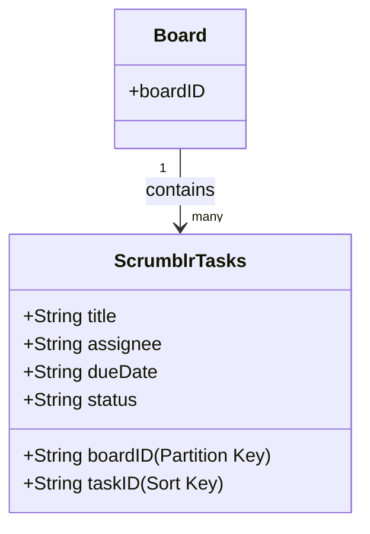

# DynamoDB Schema for Scrumblr

This document outlines the **DynamoDB schema** for storing project tasks in the Scrumblr application.  
It is optimized for **Kanban board views** and supports all core CRUD operations.

---

## Table Name
**`ScrumblrTasks`**

---

## Primary Key

The table uses a **composite primary key** to uniquely identify each task and to organize tasks by project board.

- **Partition Key:** `boardID` *(String)*  
  Groups all tasks belonging to a single Kanban board.  
  - For the MVP, this can be a static value such as `"Group1Project"`.  
  - In a multi-project scenario, this would be a unique identifier for each project.

- **Sort Key:** `taskID` *(String)*  
  A unique identifier for each individual task (e.g., UUID or unique string).  
  Ensures each item within a given `boardID` is unique.

---

## Attributes

Each item (task card) will contain the following attributes:

- **`title`** *(String)* → The name/title of the task.  
- **`assignee`** *(String)* → The person responsible for completing the task.  
- **`dueDate`** *(String)* → The deadline for the task.  
- **`status`** *(String)* → The current status of the task (Kanban column).  

  **Possible values:**
  - `"Not Started"`
  - `"In Progress"`
  - `"Completed"`

---

## Example Item

```json
{
  "boardID": "Group1Project",
  "taskID": "f8a4e3b1-2c1a-4d9e-8a0b-1f2e3d4c5a6b",
  "title": "Design user interface",
  "assignee": "Meriam",
  "dueDate": "2025-10-15",
  "status": "In Progress"
}
```
## CRUD Operations & Access Patterns

This schema supports the core CRUD operations required by Scrumblr:

***Create (Add Task)***

Operation: PutItem

Input: A new taskID and default status = "Not Started".

***Read (Get Board)***

Operation: Query

Input: boardID

Result: Retrieves all tasks for the current project.

The frontend sorts tasks into columns based on the status attribute.

***Update (Move/Edit Task)***

Operation: UpdateItem

Key: boardID + taskID

Update: One or more of status, assignee, title, dueDate.

***Delete (Remove Task)***

Operation: DeleteItem

Key: boardID + taskID.

### Sample Code (CRUD Examples):

#### JavaScript (AWS SDK v3)

```javascript
import { DynamoDBClient, PutItemCommand, QueryCommand, UpdateItemCommand, DeleteItemCommand } from "@aws-sdk/client-dynamodb";

const client = new DynamoDBClient({ region: "us-east-1" });

// Create (Add Task)
async function addTask(boardID, taskID, title, assignee, dueDate) {
  const params = {
    TableName: "ScrumblrTasks",
    Item: {
      boardID: { S: boardID },
      taskID: { S: taskID },
      title: { S: title },
      assignee: { S: assignee },
      dueDate: { S: dueDate },
      status: { S: "Not Started" }
    }
  };
  await client.send(new PutItemCommand(params));
}

// Read (Get all tasks for board)
async function getBoardTasks(boardID) {
  const params = {
    TableName: "ScrumblrTasks",
    KeyConditionExpression: "boardID = :b",
    ExpressionAttributeValues: {
      ":b": { S: boardID }
    }
  };
  const result = await client.send(new QueryCommand(params));
  return result.Items;
}

// Update (Edit task)
async function updateTask(boardID, taskID, updates) {
  const params = {
    TableName: "ScrumblrTasks",
    Key: {
      boardID: { S: boardID },
      taskID: { S: taskID }
    },
    UpdateExpression: "SET #s = :s, assignee = :a, title = :t, dueDate = :d",
    ExpressionAttributeNames: {
      "#s": "status"
    },
    ExpressionAttributeValues: {
      ":s": { S: updates.status },
      ":a": { S: updates.assignee },
      ":t": { S: updates.title },
      ":d": { S: updates.dueDate }
    }
  };
  await client.send(new UpdateItemCommand(params));
}

// Delete (Remove task)
async function deleteTask(boardID, taskID) {
  const params = {
    TableName: "ScrumblrTasks",
    Key: {
      boardID: { S: boardID },
      taskID: { S: taskID }
    }
  };
  await client.send(new DeleteItemCommand(params));
}
```

Python (boto3)

```Python
import boto3
from boto3.dynamodb.conditions import Key

dynamodb = boto3.resource("dynamodb", region_name="us-east-1")
table = dynamodb.Table("ScrumblrTasks")

# Create (Add Task)
def add_task(boardID, taskID, title, assignee, dueDate):
    table.put_item(Item={
        "boardID": boardID,
        "taskID": taskID,
        "title": title,
        "assignee": assignee,
        "dueDate": dueDate,
        "status": "Not Started"
    })

# Read (Get all tasks for a board)
def get_board_tasks(boardID):
    response = table.query(KeyConditionExpression=Key("boardID").eq(boardID))
    return response["Items"]

# Update (Edit task)
def update_task(boardID, taskID, updates):
    table.update_item(
        Key={"boardID": boardID, "taskID": taskID},
        UpdateExpression="SET #s = :s, assignee = :a, title = :t, dueDate = :d",
        ExpressionAttributeNames={"#s": "status"},
        ExpressionAttributeValues={
            ":s": updates["status"],
            ":a": updates["assignee"],
            ":t": updates["title"],
            ":d": updates["dueDate"]
        }
    )

# Delete (Remove task)
def delete_task(boardID, taskID):
    table.delete_item(Key={"boardID": boardID, "taskID": taskID})
```
## Schema Diagram


